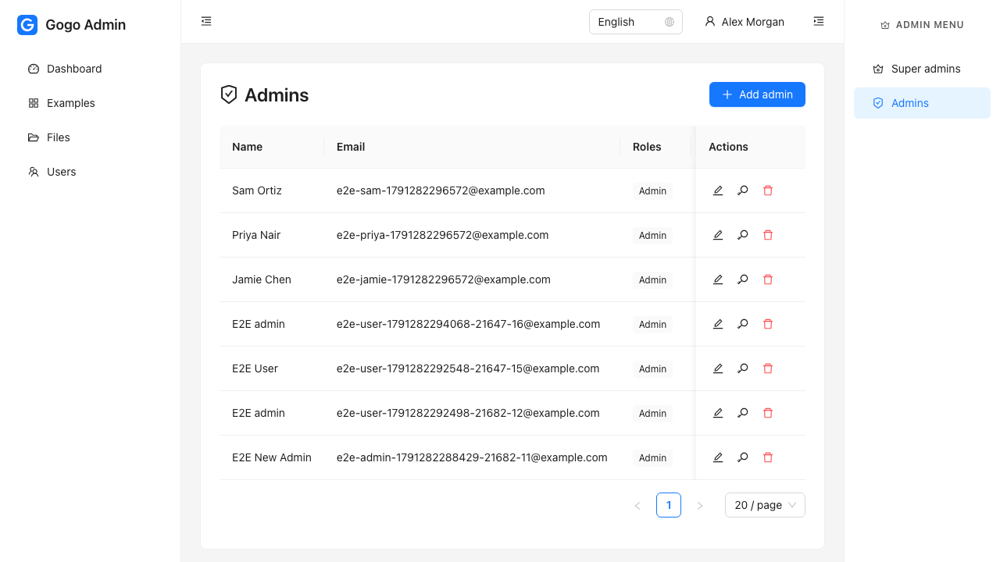
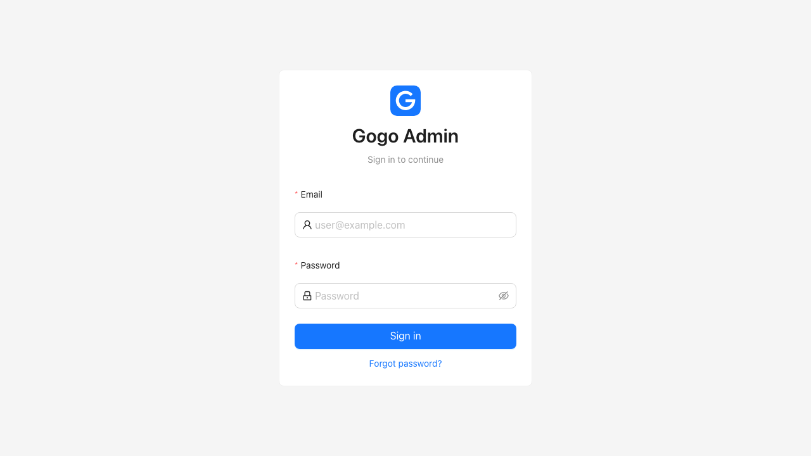
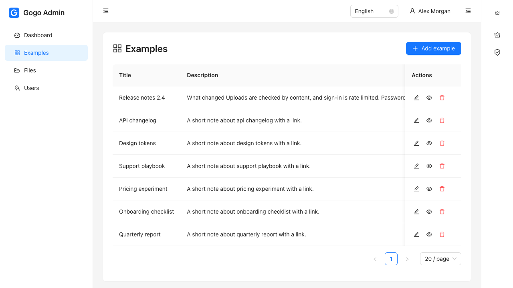
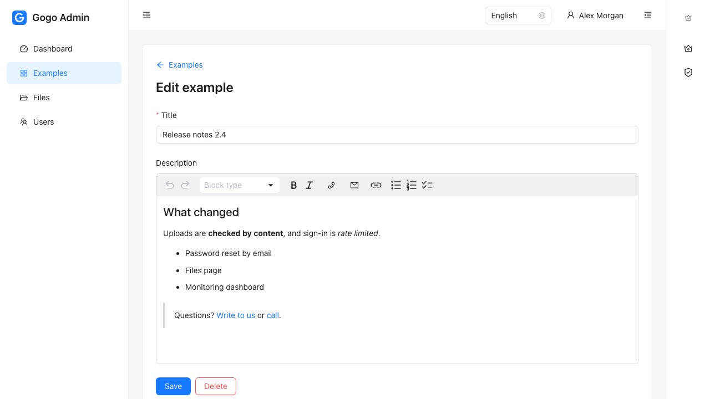
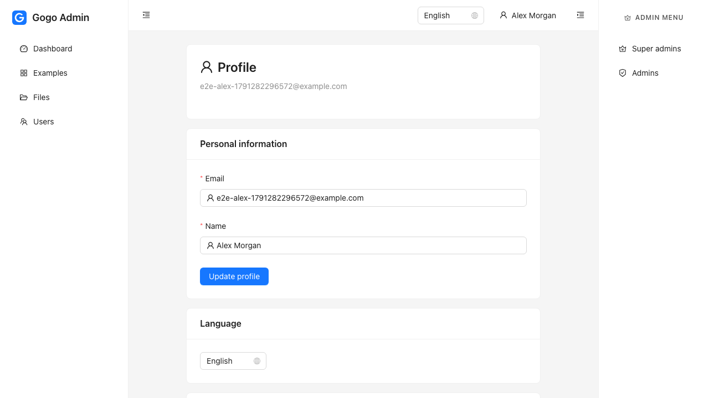
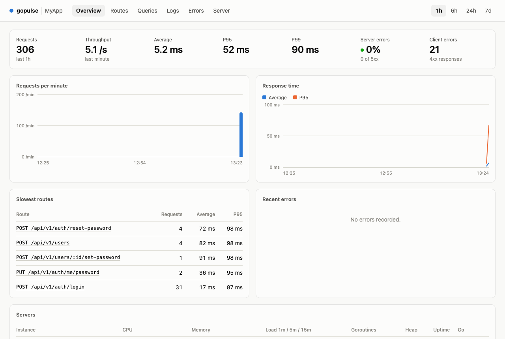
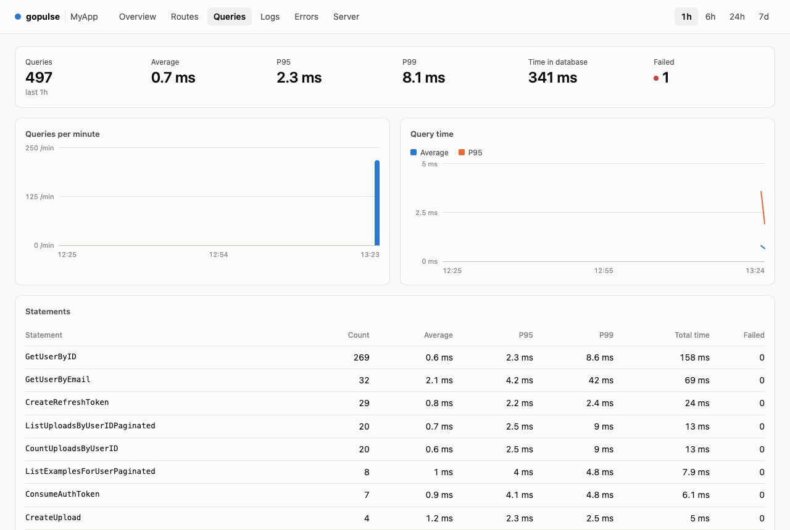
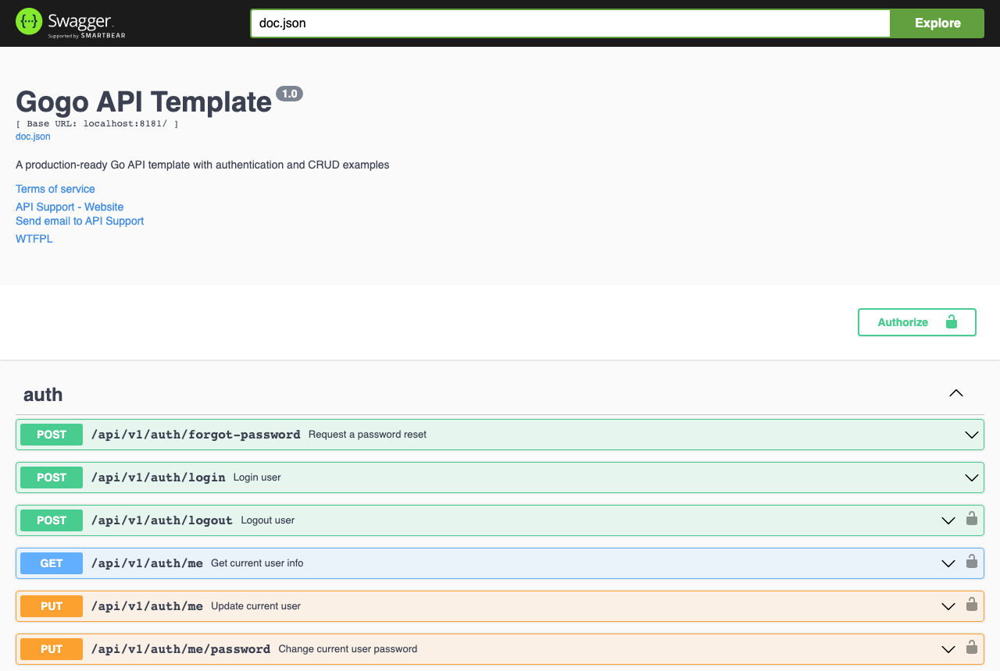
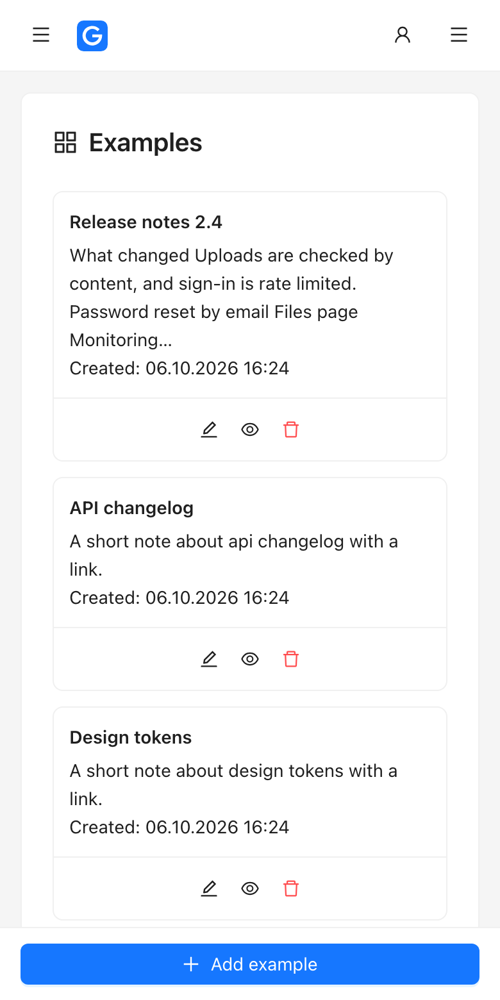

<p align="center">
  
</p>

<h1 align="center">Gogokit</h1>

<p align="center">
  A full-stack starter kit: a Go API, a React admin panel, backups, and one command to put it on a server.<br>
  Built for the ease of starting a project that Laravel gives you, in Go, and for working with coding agents.
</p>

<p align="center">
  <a href="https://github.com/nicklasos/gogokit/actions/workflows/ci.yml"></a>
  
  
  
  
  
  
</p>

<p align="center">
  <a href="#run-it-locally">Run it locally</a> ·
  <a href="#whats-inside">What's inside</a> ·
  <a href="#screenshots">Screenshots</a> ·
  <a href="#deploy-to-a-new-server">Deploy</a> ·
  <a href="#start-a-project-from-it">Start a project</a>
</p>



---

Four folders, one repository:

| Folder | What it is |
|---|---|
| [`backend/`](backend) | Go API: Gin, PostgreSQL through sqlc, Redis, JWT auth with roles |
| [`frontend/`](frontend) | Admin panel: React, TypeScript, Ant Design, TanStack Query |
| [`backup/`](backup) | Scripts that back up the database and uploaded files to disk or Google Cloud Storage |
| [`deploy/`](deploy) | Ansible that provisions a server and deploys the three above |

It is a skeleton, not a framework: there is no ORM and no code you cannot read. You copy it, rename it and start adding modules.

## What's inside

**Backend**
- Login with rotating refresh tokens, password reset and email verification by emailed link
- Roles (`super-admin`, `admin`, `user`), per-record policies, and user management
- Login rate limiting with escalating lockout
- File uploads checked by content, behind a storage interface
- Mail, cache, cron scheduler, transactions helper, request IDs in every log line
- Tests against a real PostgreSQL that roll back after each test, with factories for test data
- Swagger documentation generated from the code

**Frontend**
- Sign-in, forgot and reset password, email confirmation
- User management for super admins and admins, profile, files
- A reference CRUD module with a server-paginated list and a markdown editor
- TypeScript types generated from the API's OpenAPI file
- Server validation errors shown under the right form field; English and Ukrainian
- Tables become cards on phones; a page that crashes does not take the app down
- Playwright tests that run against the real API

**Monitoring**
- A dashboard served by the API itself ([gopulse](https://github.com/nicklasos/gopulse)): requests per route, errors and panics, SQL statistics by query name, logs, server load

**Operations**
- Nightly backups of the database and uploaded files, with retention
- One playbook from an empty Ubuntu server to a running site with TLS, and another to release new code
- CI for the API, the admin panel and the playbooks

**For coding agents**
- An `AGENTS.md` in every folder, and step-by-step recipes for the common changes
  ([backend](backend/docs/recipes), [frontend](frontend/docs/recipes)), also available as Claude Code skills

## Screenshots

| Sign in | A list with server-side paging |
|---|---|
|  |  |

| Markdown editor | Profile |
|---|---|
|  |  |

| Monitoring: requests | Monitoring: SQL queries |
|---|---|
|  |  |

| API documentation | On a phone |
|---|---|
|  |  |

## Run it locally

You need Go 1.25+, Node.js 22+, Docker (for PostgreSQL and Redis) and Make.

```bash
git clone git@github.com:nicklasos/gogokit.git && cd gogokit

# Backend
cd backend
cp .env.example .env
make sqlc-install migrate-install air-install   # once: sqlc, goose, air
make up                                         # PostgreSQL, Redis and a mail catcher in Docker
make migrate-up
make seed                                       # admin@example.com / password123, and sample data
make dev                                        # http://localhost:8181

# Frontend, in a second terminal
cd frontend
cp .env.example .env
npm install
npm run dev                                     # http://localhost:5173
```

Sign in at http://localhost:5173 with `admin@example.com` / `password123`.

| | |
|---|---|
| Admin panel | http://localhost:5173 |
| API documentation | http://localhost:8181/swagger/index.html |
| Monitoring | http://localhost:8181/_pulse (set `PULSE_PASSWORD` in `backend/.env` first) |
| Caught emails | http://localhost:8025 |

Run every test in the kit with `make test` from the root.

## Deploy to a new server

A fresh Ubuntu 22.04 or 24.04 server, a domain pointing at it, and Ansible on your machine:

```bash
cd deploy
ansible-galaxy collection install -r requirements.yml
cp inventory/hosts.example.yml inventory/hosts.yml       # the server's address
cp secrets.example.yml group_vars/all/secrets.yml        # passwords: openssl rand -hex 32
$EDITOR group_vars/all/main.yml                          # app name, domain, repository, TLS mode
ansible-playbook provision.yml
```

That installs PostgreSQL, Redis, Go, Node.js, nginx and supervisor, creates the database and the
directories, builds the API and the admin panel, obtains a certificate, and schedules the backups.
To release new code afterwards:

```bash
ansible-playbook deploy.yml
```

Everything about it, including the three TLS modes and what ends up where on the server, is in
[deploy/README.md](deploy/README.md).

> The playbooks pass Ansible's syntax check and the nginx configuration they generate is validated,
> but they have not been run against a real server yet. Do the first run on one you can throw away.

## Start a project from it

1. Copy this repository into a new one (GitHub's "Use this template", or clone and change the remote).
2. In `deploy/group_vars/all/main.yml` set `app_name`, `domain` and `repo_url`.
3. Rename what users see: `APP_NAME` in `backend/.env`, `common.appName` in the two files under
   `frontend/src/locales`, and the logo in `frontend/public/favicon.svg`.
4. Build your first module with the recipes: `backend/docs/recipes/add-module.md`, then
   `frontend/docs/recipes/add-feature.md`. `backend/internal/example` and
   `frontend/src/features/examples` are the references, and can be deleted once you have your own.

From then on the project owns all four folders. Do not run `make sync` in it.

## How the kit is maintained

`backend/`, `frontend/` and `backup/` are copies of three repositories, where the development happens:

| Folder | Source |
|---|---|
| `backend/` | [nicklasos/gogo](https://github.com/nicklasos/gogo) |
| `frontend/` | [nicklasos/gogo-front](https://github.com/nicklasos/gogo-front) |
| `backup/` | [nicklasos/backupit](https://github.com/nicklasos/backupit) |

`make sync` refreshes them: it copies the committed files of each source, renames the paths between
them (`../gogo` becomes `../backend`), and records the source commits in `.kit-sources`. Changes made
directly in those three folders of the kit are overwritten by the next sync, so make them in the source.
`deploy/`, `scripts/`, `docs/` and the root files live only here.

## More

- [backend/README.md](backend/README.md): API endpoints, configuration, patterns
- [frontend/README.md](frontend/README.md): structure, commands, conventions
- [backup/README.md](backup/README.md): storage backends, restore
- [deploy/README.md](deploy/README.md): provisioning and releasing
- [AGENTS.md](AGENTS.md): the guide for coding agents
