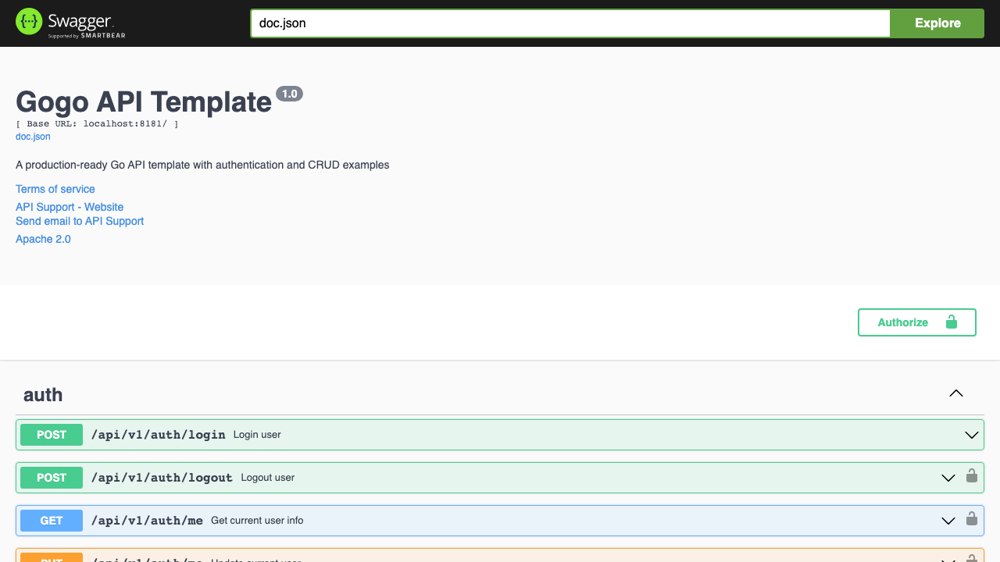
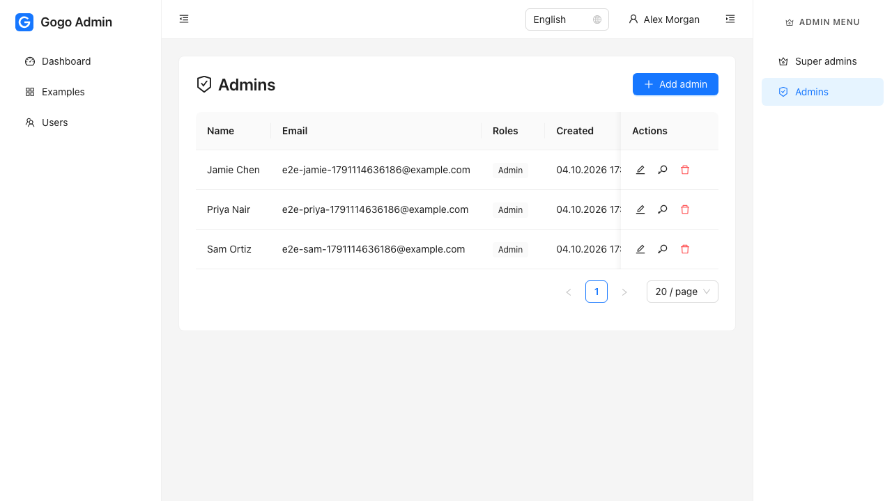
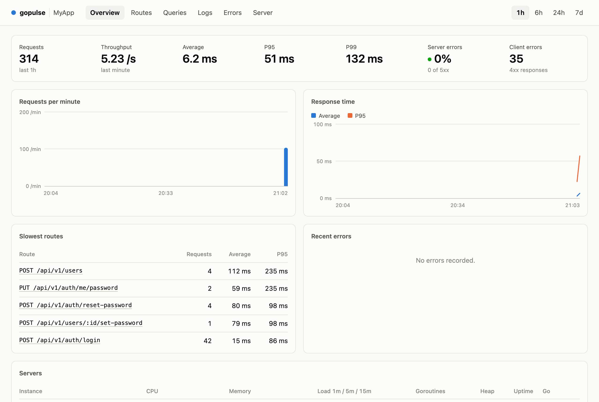
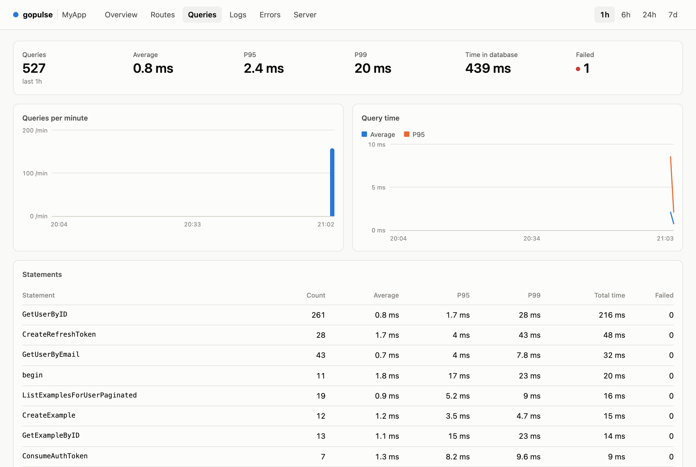
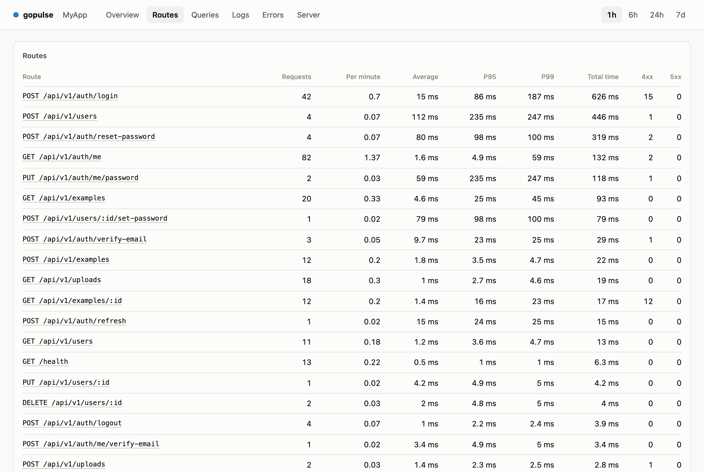
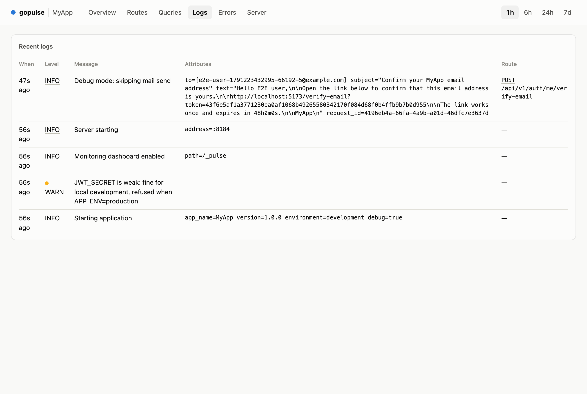

<p align="center">
  
</p>

<h1 align="center">Gogo</h1>

<p align="center">
  A lightweight Go API starter kit: the parts every project needs, wired together and tested.<br>
  Gin, PostgreSQL, sqlc, Goose, Redis, JWT auth with roles.
</p>

<p align="center">
  
  
  
  
  
  
  <a href="LICENSE.md"></a>
</p>

<p align="center">
  <a href="#quick-start">Quick start</a> ·
  <a href="#features">Features</a> ·
  <a href="#api-endpoints">API</a> ·
  <a href="#adding-new-modules">Add a module</a> ·
  <a href="ROADMAP.md">Roadmap</a>
</p>

---

Gogo is a skeleton, not a framework: copy it, rename it, and start writing modules. There is no ORM and no repository layer — services call type-safe sqlc queries directly, and tests run against a real PostgreSQL inside a transaction that is rolled back.

It pairs with **[gogo-front](https://github.com/nicklasos/gogo-front)**, a React + Ant Design admin UI built for this API.

| Swagger UI | Admin UI (gogo-front) |
|---|---|
|  |  |

A monitoring dashboard is built in, served by the API itself through **[gopulse](https://github.com/nicklasos/gopulse)**:

| Requests and response times | SQL queries, by sqlc name |
|---|---|
|  |  |

| Routes | Logs |
|---|---|
|  |  |

## Quick Start

### Prerequisites
- Go 1.25+, PostgreSQL 13+, Redis 6+, Make

### Setup
```bash
git clone git@github.com:nicklasos/gogo.git my-api && cd my-api

# Tools: sqlc, goose, air
go mod tidy
make sqlc-install migrate-install air-install

# Configuration (JWT_SECRET is required)
cp .env.example .env

# Postgres, Redis and a mail catcher in Docker (creates the gogo and gogo_test databases).
# Skip this if you run Postgres and Redis yourself: createdb gogo && createdb gogo_test
make up
make migrate-up

# Accounts and sample data (admin@example.com / password123, and more)
make seed

# Run with hot reload
make dev
```

The API listens on http://localhost:8181 and the Swagger UI is at http://localhost:8181/swagger/index.html.

```bash
curl -s localhost:8181/api/v1/auth/login \
  -H 'Content-Type: application/json' \
  -d '{"email":"admin@example.com","password":"password123"}'
```

Run the tests with `make test`; it migrates the test database first.

## Features

- **Authentication**: JWT auth with login, rotating refresh tokens, profile and password change, and logout (revokes refresh tokens)
- **Password reset and email verification**: single-use emailed links, stored only as hashes
- **Login rate limiting**: per-IP bursts and an escalating lockout per email, with `Retry-After`
- **Safe defaults**: registration closed unless `ALLOW_REGISTRATION=true`, and a weak `JWT_SECRET` is refused in production
- **Roles**: `super-admin`, `admin`, `user` with `RequireRole` middleware; roles are read from the database on every request
- **User management**: super admins manage super admins and admins, admins manage users
- **Mail**: SMTP service (`app.Mail`), logged instead of sent in debug mode, with an in-memory sender for tests
- **Policies**: who may do what to a record, one small `policy.go` per module
- **Factories and seed data**: `factory.User(t, tx, factory.WithRoles("admin"))` in tests, `make seed` for a development database
- **Agent recipes**: step-by-step procedures in `docs/recipes/` for the common changes, also available as Claude Code skills
- **Transactions**: `app.Tx.WithTx(ctx, func(q *db.Queries) error { ... })`
- **Request ID**: `X-Request-ID` on every response and in every `*Context` log line
- **Graceful shutdown** and env-driven CORS
- **CRUD Example**: Complete example module with Redis `Remember` caching
- **Pagination**: `?page` / `?page_size` parsing and a `pagination` block on every list
- **Type Safety**: SQLC for type-safe database operations
- **Swagger**: Auto-generated API documentation
- **Uploads**: content-checked file upload behind a `Storage` interface, paginated list, and file serving without directory listings
- **Docker and CI**: `docker-compose.yml` for local services, a production `Dockerfile`, and a GitHub Actions workflow
- **Monitoring dashboard**: requests per route, errors and panics, SQL statistics by sqlc query name, recent logs and server load at `/_pulse`
- **Healthcheck**: `/health` checks PostgreSQL and Redis and answers 503 when either is down
- **Scheduler**: Optional cron jobs (refresh-token cleanup)

## Tech Stack

- **Go 1.25+** + **Gin** - API framework
- **PostgreSQL** + **pgx/v5** - Database with connection pooling
- **SQLC** - Type-safe SQL code generation
- **Redis** + **go-redis/v9** - Caching
- **Goose** - Database migrations
- **JWT** - Authentication
- **Swaggo** - API documentation

## Project Structure

```
gogo/
├── cmd/api/main.go              # Application entry point (--port, --test-db)
├── cmd/cron/main.go             # Standalone scheduler
├── cmd/cli/main.go              # CLI (migrate, create-user, test)
├── internal/
│   ├── app.go                   # App context with DB, Tx, Cache, Logger, Mail
│   ├── server/                  # Engine middleware + the list of modules
│   ├── auth/                    # Authentication module
│   ├── users/                   # User management
│   ├── example/                 # Example CRUD module (cache demo)
│   ├── uploads/                 # File uploads
│   ├── db/queries/              # SQL queries (sqlc)
│   ├── middleware/              # JWT, roles, CORS, request ID, pagination, recovery
│   ├── cache/                   # Redis + MemoryCache
│   ├── mail/                    # SMTP mail service + MemorySender
│   ├── monitoring/              # gopulse dashboard wiring
│   ├── errs/                    # Domain errors
│   └── scheduler/               # Cron jobs
├── migrations/                  # Goose database migrations
└── sqlc.yaml
```

## Development Commands

```bash
make help             # List all targets

# Development
make dev              # Hot reload server
make run              # Start API
make run-test-db      # Start API against TEST_DATABASE_URL
make test             # Run all tests (auto-migrates test DB)

# Database & SQLC
make migrate-up       # Apply migrations
make sqlc             # Generate SQLC code (run after SQL changes!)

# Documentation
make swagger          # Generate API docs
```

## API Endpoints

### Auth
- `POST /api/v1/auth/register` - Register new user (403 unless `ALLOW_REGISTRATION=true`)
- `POST /api/v1/auth/login` - Login
- `POST /api/v1/auth/refresh` - Refresh token
- `GET /api/v1/auth/me` - Get current user with roles (protected)
- `PUT /api/v1/auth/me` - Update name and email (protected)
- `PUT /api/v1/auth/me/password` - Change password, revokes refresh tokens (protected)
- `POST /api/v1/auth/logout` - Logout and revoke refresh tokens (protected)
- `POST /api/v1/auth/forgot-password` - Email a password reset link (always 200)
- `POST /api/v1/auth/reset-password` - Set a new password with the emailed token
- `POST /api/v1/auth/verify-email` - Confirm an email address with the emailed token
- `POST /api/v1/auth/me/verify-email` - Send the verification email again (protected)

### Users (admin and super admin)
- `GET /api/v1/users?role=user|admin|super-admin` - Paginated list of users with a role
- `POST /api/v1/users` - Create a user with one role
- `PUT /api/v1/users/:id` - Update name and email
- `POST /api/v1/users/:id/set-password` - Set a password, revokes the user's refresh tokens
- `DELETE /api/v1/users/:id` - Delete a user (not yourself)

Admins can only manage accounts whose role is `user`; anything else returns 403 `users.forbidden_role`.

### Examples
- `GET /api/v1/examples` - List examples with pagination (protected, cached)
- `POST /api/v1/examples` - Create example (protected)
- `GET /api/v1/examples/:id` - Get example (protected)
- `PUT /api/v1/examples/:id` - Update example (protected)
- `DELETE /api/v1/examples/:id` - Delete example (protected)

### Uploads
- `POST /api/v1/uploads` - Upload a file (protected)
- `GET /api/v1/uploads` - List uploads with pagination (protected)
- `GET /api/v1/uploads/:id` - Get upload (protected)
- `DELETE /api/v1/uploads/:id` - Delete upload (protected)
- `GET /api/files/*` - Serve uploaded files (public)

### Other
- `GET /health` - Health check (database and cache); 503 with a per-dependency `checks` map when one is down
- `GET /api/v1/health` - Same health check under API prefix
- `GET /swagger/*` - API documentation

## Environment Variables

```bash
DATABASE_URL=postgres://postgres@localhost:5432/gogo?sslmode=disable
TEST_DATABASE_URL=postgres://postgres@localhost:5432/gogo_test?sslmode=disable
REDIS_URL=redis://localhost:6379/0
JWT_SECRET=your-secret-key-here   # production needs 32+ random characters: openssl rand -hex 32
JWT_ACCESS_TOKEN_TTL=1h
JWT_REFRESH_TOKEN_TTL=720h
ALLOW_REGISTRATION=false          # open POST /auth/register to anyone
AUTH_RATE_LIMIT=true              # throttle login, refresh and emailed-link endpoints
FRONTEND_URL=http://localhost:5173   # base of the links in emails
TRUSTED_PROXIES=127.0.0.1,::1     # whose X-Forwarded-For to believe for the client IP
PORT=8181
APP_ENV=development
APP_NAME=MyApp                 # also the Redis cache key prefix
CORS_ALLOWED_ORIGINS=          # comma-separated; empty or * allows any origin
PULSE_PASSWORD=                # set it to turn on the monitoring dashboard at /_pulse (user: PULSE_USERNAME, default admin)
MAIL_HOST=                     # plus MAIL_PORT, MAIL_SCHEME, MAIL_USERNAME, MAIL_PASSWORD, MAIL_FROM_ADDRESS, MAIL_FROM_NAME
LOG_LEVEL=info
ENABLE_SCHEDULER=false
```

## Patterns

### Context Pattern
Handlers start with small helpers that answer the error themselves and return `false`:

```go
userID, ok := middleware.CurrentUserID(c)   // 401 when not signed in
id, ok := middleware.PathID(c, "id")        // 400 when :id is not a positive integer
page, ok := middleware.Page(c)              // 400 when ?page / ?page_size are invalid
```

- `internal.RespondMessage(c, "...")` for actions with nothing to return, `internal.FormatTime(ts)` for timestamps, `internal.NewPaginationMeta(total, page, size)` for lists.
- Handlers do not log errors: a 5xx is logged once by the error middleware with the request ID, and a 4xx is not logged.

### Types.go Pattern
- All request/response types go in `types.go` within each module
- Services define internal types (e.g., `PaginatedExamplesResult`) in service files
- Handlers convert service types to response types from `types.go`

### Cache Pattern
- Use `cache.Remember` for short-lived list responses (see `example` module)
- Use `cache.MemoryCache` in tests (no Redis required)
- Invalidate on create/update/delete

## Auth

- **Tokens**: a short-lived access JWT (`JWT_ACCESS_TOKEN_TTL`) and a single-use refresh token (`JWT_REFRESH_TOKEN_TTL`) that is rotated on every refresh and stored only as a hash. Tokens are read from the `Authorization` header, never from the URL.
- **Emails** are stored lower-case and matched case-insensitively, with a unique index on `LOWER(email)`.
- **Password reset**: `forgot-password` emails `FRONTEND_URL/reset-password?token=...`. The link works once, expires after `PASSWORD_RESET_TTL`, and using it signs out every session. The endpoint answers 200 whether or not the email exists.
- **Email verification**: registration and a changed email send `FRONTEND_URL/verify-email?token=...`. Users expose `email_verified`; accounts created by an admin or the CLI start verified. Nothing is blocked for unverified users by default, so add your own check where a project needs one.
- **Rate limiting**: login allows 60 requests a minute per IP and 40 failures an hour per email and IP, then locks that pair out for 5 minutes, 15 minutes, 1 hour, 6 hours, 24 hours. Emailed-link endpoints allow 10 requests per 10 minutes per IP. A 429 carries `Retry-After` and `details.retry_after_seconds`. Behind a proxy, set `TRUSTED_PROXIES` or every client shares the proxy's IP.
- **Local development**: with `APP_DEBUG=true` emails are written to the log, link included. Or run `make up` and point `MAIL_HOST` at Mailpit (http://localhost:8025).

## Monitoring

Set `PULSE_PASSWORD` and open `http://localhost:8181/_pulse` (basic auth, user `admin` unless `PULSE_USERNAME` says otherwise). Without a password the dashboard does not exist and nothing is recorded.

- **What it shows**: requests per route with average, P95 and P99; slow requests; errors and panics grouped with their stacks; SQL statements grouped by sqlc query name, with slow and failed ones listed; recent log records; CPU, memory, disk and goroutines per instance.
- **How it is wired**: one middleware, a tracer on the pgx pool and a wrapper around the log handler, all in `cmd/api/main.go` through `internal/monitoring`. Pass the request context to queries and use the `*Context` log methods so both are linked to their request.
- **Storage**: Redis, under `gopulse:<APP_NAME>:`, so history survives deploys and several instances share one dashboard. Everything expires on its own (a week at most).
- **Your own numbers**: `monitoring.Record(app.Pulse, "orders", "created", total)` records a custom metric, and `app.Pulse.AddPage(...)` adds a tab for it. See the [gopulse README](https://github.com/nicklasos/gopulse#custom-pages).
- **In production**, keep `/_pulse` behind the password and, ideally, off the public internet.

## Mail

Modules send mail through `app.Mail` (a `mail.Sender`), passed into the service from `routes.go`:

```go
err := s.mail.Send(ctx, mail.Message{
    To:      []string{user.Email},
    Subject: "Welcome",
    Text:    "Plain-text body",
    HTML:    "<p>Optional HTML body</p>", // sent as an alternative when Text is set too
})
```

- Configure SMTP with the `MAIL_*` variables. `MAIL_SCHEME` is `smtp` (STARTTLS, default), `smtps` (implicit TLS) or `none` (plain, for local catchers such as Mailpit).
- With `APP_DEBUG=true`, `Send` only logs the recipient and subject. Nothing leaves the machine.
- `make cli -- mail -to you@example.com` sends a real test email, even in debug mode. `make cli-mail TO=you@example.com` is the same command.
- In tests, `CreateTestServer` wires a `mail.MemorySender`; assert on `server.Mail.Sent()`.

## Uploads Module

The uploads module allows users to upload files (images, videos, documents, audio) and stores metadata in the database. Files are served from `/api/files/...`.

- The extension must be on the allow list, and the first bytes must agree with it: an image extension needs image content, `.pdf` needs a PDF, and nothing may be HTML. The stored MIME type is the detected one, not the client's.
- Files get random names; the original name is kept only as metadata.
- Bytes go through the `Storage` interface. `LocalStorage` (the default) writes under `UPLOAD_FOLDER` and cannot be made to leave it. Set `UploadConfig.Storage` to your own implementation for S3 or GCS.
- `/api/files/*` serves files only (no directory listings) with `nosniff` and a sandboxing CSP.

### Configuration

```go
config := &uploads.UploadConfig{
    UploadFolder: "./uploads",
    BaseURL:      "http://localhost:8181/api/files",
    MaxFileSize:  50 * 1024 * 1024, // 50MB
    AllowedTypes: []string{".jpg", ".png", ".pdf"},
    GetFolderID: func(ctx context.Context, userID int32) (int32, error) {
        return userID, nil
    },
}
```

## Adding New Modules

Follow [docs/recipes/add-module.md](docs/recipes/add-module.md). In short:

1. Create migration: `migrations/XXX_create_table.sql`
2. Write SQL queries in `internal/db/queries/module.sql`
3. Generate code: `make sqlc`
4. Create module: `internal/module/{types,policy,service,handler,routes}.go`
5. Add `module.RegisterRoutes(app)` to `internal/server/server.go` (used by the API and the test server)
6. Add a factory in `internal/factory` and tests

## Docker

```bash
make up            # Postgres (gogo + gogo_test), Redis, Mailpit
make down
make docker-build  # production image: api, cron and cli binaries plus goose
docker compose --profile app up --build   # everything, API included
```

The image runs migrations before the API starts (`RUN_MIGRATIONS=false` turns that off). Run the scheduler from the same image with the command `/app/cron`.

## Test database

`TEST_DATABASE_URL` must point at a local database whose name ends in `_test`. Tests, `--test-db` (api, cron) and `--test` (cli) refuse anything else. Set `ALLOW_REMOTE_TEST_DB=1` to allow a remote host, for example in CI.

## Error Handling

The project uses structured error handling with the `errs` package. See `docs/ERRORS.md` for complete guide and examples.

**Quick reference:**
- Services return domain errors: `errs.NewNotFoundError(key, message)`
- Handlers use: `errs.RespondWithError(c, err)` or `errs.RespondWithValidationError(c, err)`
- DB helpers: `errs.WrapDatabaseError`, `errs.DomainErrorFromPostgresUniqueViolation`
- See `internal/example/` for complete examples

## Links

- **API Docs**: `/swagger/index.html` when running
- **Error Handling**: See `docs/ERRORS.md` for error handling guide
- **Architecture**: See `AGENTS.md` for detailed patterns
- **Deployment**: See `DEPLOYMENT.md` for supervisord setup
- **Roadmap**: See `ROADMAP.md` for what is worth adding next
