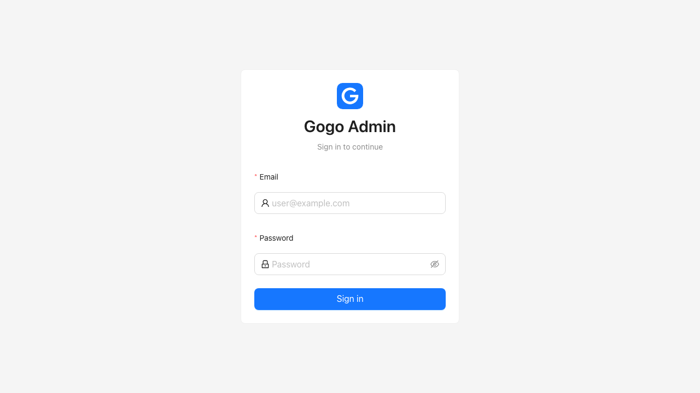
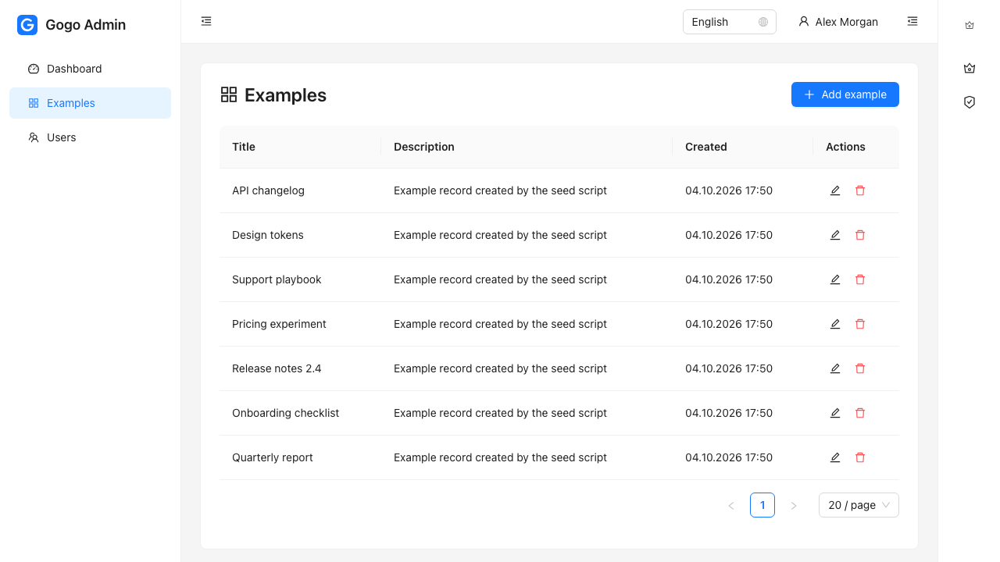
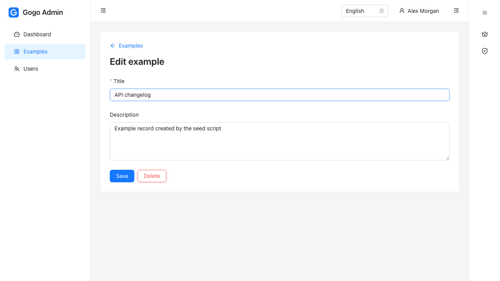
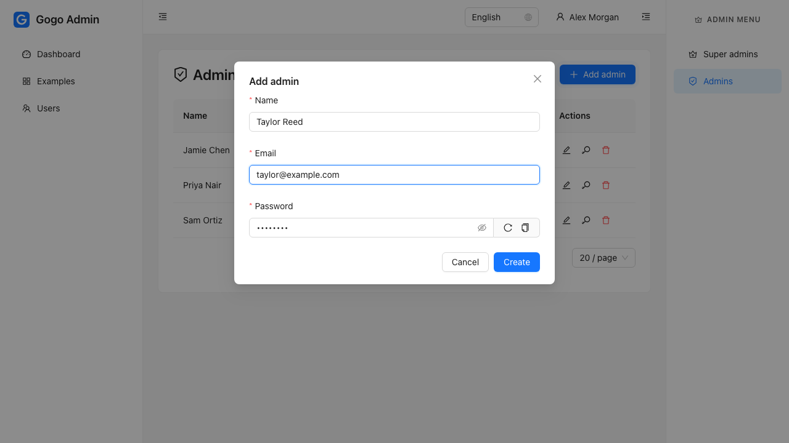
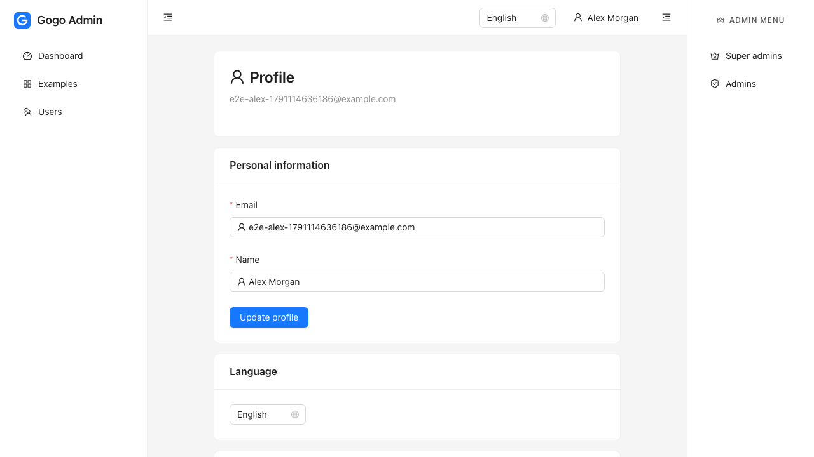
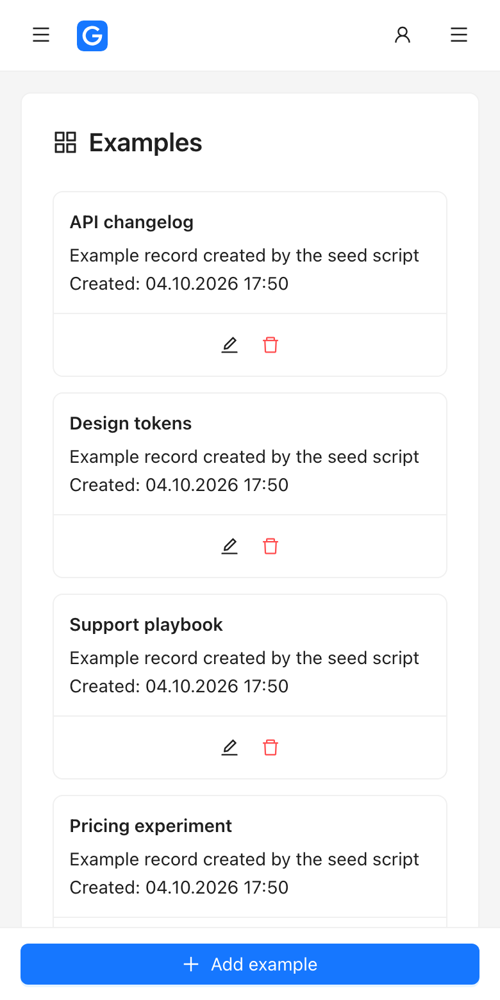

<p align="center">
  
</p>

<h1 align="center">Gogo Front</h1>

<p align="center">
  A React admin starter kit for the <a href="https://github.com/nicklasos/gogo">gogo</a> Go API.<br>
  Sign-in, roles, user management and a reference CRUD module, typed end to end and covered by tests.
</p>

<p align="center">
  
  
  
  
  
  
</p>

<p align="center">
  <a href="#quick-start">Quick start</a> ·
  <a href="#features">Features</a> ·
  <a href="#screenshots">Screenshots</a> ·
  <a href="#adding-a-module">Add a module</a> ·
  <a href="ROADMAP.md">Roadmap</a>
</p>


---

Gogo Front is a skeleton, not a framework: copy it, rename it, and add feature folders. It ships the parts every admin panel needs so a new project starts at its first real screen.

## Quick start

### Prerequisites

- Node.js 22+
- A running [gogo](https://github.com/nicklasos/gogo) API with at least one user

### Setup

```bash
git clone git@github.com:nicklasos/gogo-front.git my-admin && cd my-admin

cp .env.example .env    # VITE_API_BASE_URL points at gogo, http://localhost:8181 by default
npm install
npm run dev             # http://localhost:5173
```

Create the first super admin in the gogo repo, then sign in with it:

```bash
make cli-create-user EMAIL=admin@example.com PASSWORD=password123
```

### Tests

```bash
make playwright-browsers   # once
make test                  # typecheck, lint, unit tests, Playwright
```

The E2E run starts its own gogo API against the test database and its own Vite server, so it needs the gogo repo next to this one (`../backend`) and `TEST_DATABASE_URL` in `.env`.

## Features

- **Auth**: email/password login, automatic token refresh, session kept across reloads and tabs
- **Password reset and email verification**: forgot-password, reset and confirm pages for the emailed links, and a "try again in N minutes" message when the API throttles sign-in
- **Policies**: per-record rules (`canUpdateExample(user, example)`) that mirror the API's and decide what the UI offers
- **Agent recipes**: step-by-step procedures in `docs/recipes/` for the common changes, also available as Claude Code skills
- **Roles**: `super-admin`, `admin`, `user`, with route guards and role-filtered menus
- **User management**: super admins and admins from a right-side admin menu that only super admins see; users from the main menu
- **Profile**: name, email, language and password
- **Examples module**: a server-paginated list and an editor with an unsaved-changes guard, as the pattern to copy
- **Markdown editor**: a WYSIWYG editor (headings, lists, quotes, links, phone and email links) that saves markdown, plus a safe viewer
- **Files**: upload with type and size checks, thumbnails, paginated list
- **Generated API types**: `make api-types` turns the backend's OpenAPI file into `src/api/schema.ts`
- **Typed API client**: `ApiError`, server validation errors mapped onto form fields, translated error keys
- **Resilient**: a page that crashes shows an error screen inside the shell instead of blanking the app, unknown URLs get a not-found page, and every page is a lazily loaded chunk
- **Responsive**: tables become cards and the primary action becomes a bottom bar on phones
- **i18n**: English and Ukrainian
- **Docker and CI**: an nginx image that serves the build and proxies `/api`, and a GitHub Actions workflow that runs the whole suite
- **Tests**: unit tests on `node:test`, Playwright E2E with page objects, everything in TypeScript

## Screenshots

| Sign in | List with server-side paging |
|---|---|
|  |  |

| Editor | Create an admin |
|---|---|
|  |  |

| Profile | On a phone |
|---|---|
|  |  |

## Make targets

```bash
make help
make typecheck
make lint            # typecheck + eslint
make test-unit       # node:test
make test-e2e        # Playwright (starts gogo --test-db + Vite on the E2E ports)
make test            # everything
make build
make api-types       # regenerate src/api/schema.ts from ../backend/docs/swagger.json
make api-types-check # fail if it is out of date (CI runs this)
make playwright-browsers
```

## Env

| Variable | Purpose |
|----------|---------|
| `VITE_API_BASE_URL` | gogo API origin, e.g. `http://localhost:8181` (the client appends `/api/v1`) |
| `PORT` | Dev server port (default `5173`) |
| `TEST_FRONTEND_PORT` | E2E Vite port (default `5175`) |
| `TEST_BACKEND_PORT` | E2E gogo port (default `8184`) |
| `VITE_E2E_API_BASE_URL` | API base used by E2E helpers (default `http://localhost:8184/api/v1`) |
| `TEST_DATABASE_URL` | gogo test database for E2E seeding; the name must end in `_test` |

The E2E ports are specific to this project so Playwright never attaches to another project's servers. Change them when you copy the skeleton.

## Project structure

```
src/
  app/        App, providers, queryClient, router, theme, i18n
  api/        client (fetch + refresh-on-401), ApiError, shared types, query keys
  auth/       authStore (persist key: gogo-auth), roles, guards, LoginPage
  layout/     AppShell, nav registry
  shared/     components, hooks, utils, lib/unsavedChanges
  features/   dashboard, examples, uploads, users, account
  locales/{en,uk}/
tests/e2e/    Playwright specs, page objects, helpers
```

## Adding a module

Follow [docs/recipes/add-feature.md](docs/recipes/add-feature.md), or [full-stack-feature.md](docs/recipes/full-stack-feature.md) when the API side is new too. In short: `src/features/<module>/{types,api,hooks,policy}.ts` and `pages/`, query keys, a route, a menu entry and locale keys. `features/examples` is the reference.

## API contract (gogo)

- Success: `{ "data": ... }`; paginated lists: `{ "data": [...], "pagination": { total, current_page, last_page, per_page } }`
- Errors: `{ "error_key", "message", "status" }`; validation: `{ "error_key": "validation.failed", "errors": { "field": ["validation.field.rule"] } }`
- `/auth/login` returns `{ access_token, refresh_token, user }`; `user` is `{ id, email, name, roles }`

## Docker

```bash
docker build -t gogo-front .
docker run -p 8080:80 -e API_UPSTREAM=http://host.docker.internal:8181 gogo-front
```

The image is the production build behind nginx. With `VITE_API_BASE_URL` left empty at build time the app calls its own origin, and nginx forwards `/api` and `/health` to `API_UPSTREAM`.

## CI

`.github/workflows/ci.yml` checks out this repository and the backend side by side, starts Postgres and Redis, and runs `make api-types-check`, `make test` and the build. The backend repository is named in the workflow; change it when you copy the skeleton.

## Roadmap

See `ROADMAP.md`.
